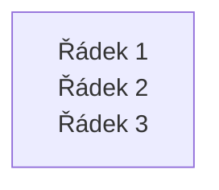
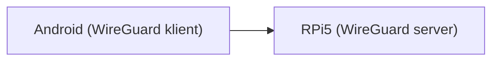

## 1. Markdown odkazy – vždy používej ostré závorky pro URL

Při generování **Markdown odkazů** vždy zapisuj cílovou část (URL/cestu) do _ostrých závorek_ `<>`, a to i mimo Mermaid diagramy. To je důležité zejména tehdy, když:

- název souboru nebo cesta obsahuje **mezery**,
- používáš **diakritiku** nebo jiné speciální znaky v názvu souboru.

### Správné vs. špatné příklady

```markdown
<!-- SPRÁVNĚ – URL v ostrých závorkách -->

[Specifikace případu](</20251111 __Zadání etapy.md>)
[README](</docs/Projekt README.md>)

<!-- TAKÉ SPRÁVNĚ – bez mezer v názvu souboru (závorky nejsou nutné, ale nevadí) -->

[Specifikace případu](/20251111_zadani_etapy.md)

<!-- ŠPATNĚ – mezery v URL bez ostrých závorek, nebude se renderovat jako link -->

[Specifikace případu](./20251111 \_\_Zadání etapy.md)
```

**Shrnutí pro agenta:**  
Kdykoli generuješ Markdown odkaz, napiš ho ve tvaru:

```markdown
[Text odkazu](</cesta/k/souboru s mezerami.md>)
```

a preferuj názvy souborů **bez mezer**, pokud to uživatel výslovně neurčí jinak.
---

## 2) Mermaid – popisky uzlů v hranatých závorkách vždy v uvozovkách

Při generování Mermaid diagramů (zejména `flowchart`) **vždy** zapisuj uzly definované pomocí hranatých závorek `[...]` tak, aby byl **celý text uvnitř závorek v uvozovkách**:

- ✅ `A["Text uzlu"]`
- ✅ `note1(["Poznámka"])`
- ❌ `A[Text uzlu]` (často způsobí chybu parseru / renderu)

### Doporučení pro více řádků v popisku
Mermaid bývá citlivý na „surové“ zalomení řádku uvnitř popisku uzlu. Preferuj HTML break:



### Příklad správného uzlu + hrany


**Shrnutí pro agenta:**  
Kdykoli použiješ uzel ve tvaru `ID[...]`, vždy piš `ID["..."]` (nebo `ID(["..."])` pro kulatý tvar), aby byl popisek jednoznačně string a Mermaid nepadal na parsování.
